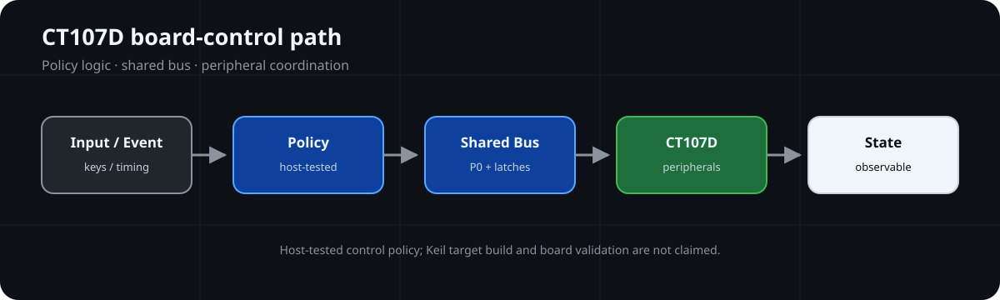
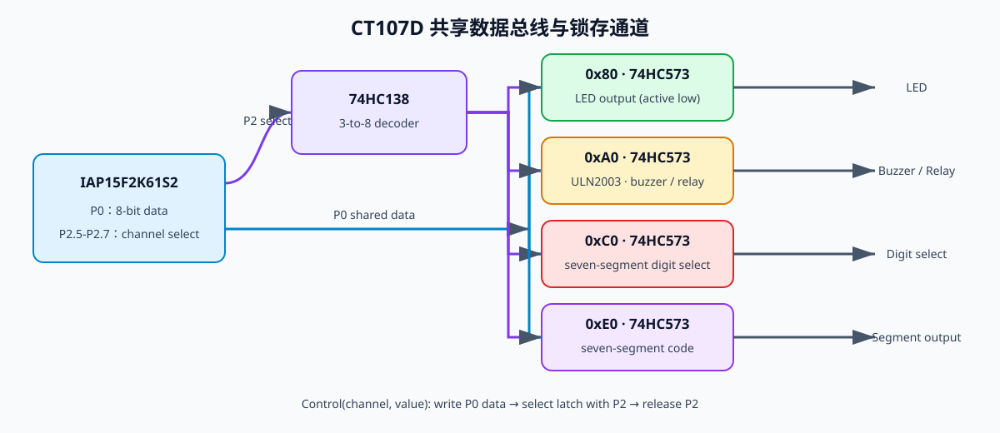

# BlueBridgeCup-MCU

面向蓝桥杯单片机方向的 CT107D 板级资源分析与外设可靠性实践。

**🔌 CT107D Shared Resources**



## Board Snapshot

| Board Focus | Current Scope |
| --- | --- |
| MCU / Board | CT107D V31/V40、IAP15F2K61S2；Keil 使用兼容器件配置 |
| Shared Resources | P0 数据总线、P2 / 74HC138 / 74HC573 锁存选择 |
| Timing & Interfaces | Timer2 周期节拍、UART、I²C、1-Wire、RTC |
| Host Evidence | Portable policy and UART state tests use GCC/Clang in CI; no C51 target result |
| Hardware Scope | Keil 目标构建与 CT107D 实机验证未执行 |

> ⏱️ **Evidence:** Peripheral policies host-tested · GCC build passed · Keil target and hardware validation not performed

## 📌 Overview

仓库重点展示共享总线、锁存器、定时节拍和通信接口如何进入综合控制程序，并用可在主机端验证的策略层处理常见边界问题。

外设范围包括 74HC138/74HC573、LED、数码管、独立键/矩阵键、UART、PCF8591、AT24C02、DS18B20 与 DS1302。

## 🏗️ Architecture

### Timing and Shared Bus



P0 是共享的 8 位数据通路，P2.5-P2.7 通过 74HC138 选择 74HC573 锁存目标。LED、蜂鸣器/继电器、数码管位选和段选因此必须结合“数据 + 通道”理解；Timer2 则为显示刷新、按键扫描和软件任务提供周期节拍。

## ✨ Key Features

| 模块 | 当前仓库中的工程价值 |
| --- | --- |
| 板级资源表 | 说明 P0/P2 锁存通路、P3/UART 复用与定时器分工 |
| I²C 策略 | 丢弃 PCF8591 前次转换字节；区分 NACK、总线占用和 STOP 失败 |
| DS18B20 策略 | 启动与读取分离，外部等待至少 750 ms；CRC 与温度状态分开 |
| UART 策略 | RX 中断入队；TX 有界等待且超时不盲目重发 |
| RTC 启动策略 | 检查 CH 位与 BCD 范围，仅在数据无效时写默认值 |
| 按键与资源策略 | 约束扫描周期、键值范围和共享引脚使用 |

## 📂 Project Structure

```text
practice/peripheral-driver-corrections/
  iic_safe.*              I²C/PCF8591 事务边界
  ds18b20_safe.*          1-Wire 转换时序
  uart_safe.*             UART 队列与中断职责
  rtc_startup.*           RTC 有效性与启动策略
  key_task_safe.*         周期扫描与键值处理
  peripheral_policy.*     可移植策略与主机测试
  tests/                  GCC/Clang 主机边界测试
.github/workflows/host-tests.yml  PR 与 main 的主机 CI
docs/                     CT107D、竞赛结构与调试记录
assets/images/            自绘板级架构图
```

## 📚 Documentation

- [CT107D 硬件分析](docs/CT107D硬件分析.md)
- [资源分配与竞赛工程结构](docs/CT107D资源分配与竞赛工程结构.md)
- [从模块到综合程序](docs/蓝桥杯竞赛体系.md)
- [实践路线](docs/学习路线.md)
- [外设驱动实践](practice/peripheral-driver-corrections/README.md)

## 🧪 Verification

### 💻 Host Test

主机测试覆盖 RTC BCD、按键条件、DS18B20 转换/CRC/温度解码、UART 队列及有界 TX 状态、PCF8591 事务顺序和失败路径。测试使用模拟寄存器/总线回调，不验证板端电气时序。

### 🔨 Build Verification

可移植策略层和 UART Host shim 已使用 GCC 与严格警告选项完成本地构建；PR 的 GCC/Clang CI 结果需按实际运行 SHA 核验。Keil C51 Target Build 尚未执行。

### 🔌 Hardware Validation

**Status:** Not Performed. 当前公开验证不包含 Keil 目标构建、板端下载、逻辑分析仪波形或传感器实测。

### 📊 Runtime Evidence

现有运行证据仅限主机测试，不代表 CT107D 实机运行结果；硬件相关内容仍需实机复测。

## License Boundary

根目录 [MIT License](LICENSE) 适用于仓库维护者编写的代码、文档与 SVG 图示。CT107D 资料、芯片/器件文档、比赛材料及未随仓库分发的第三方实现保留各自的权利与许可边界。
